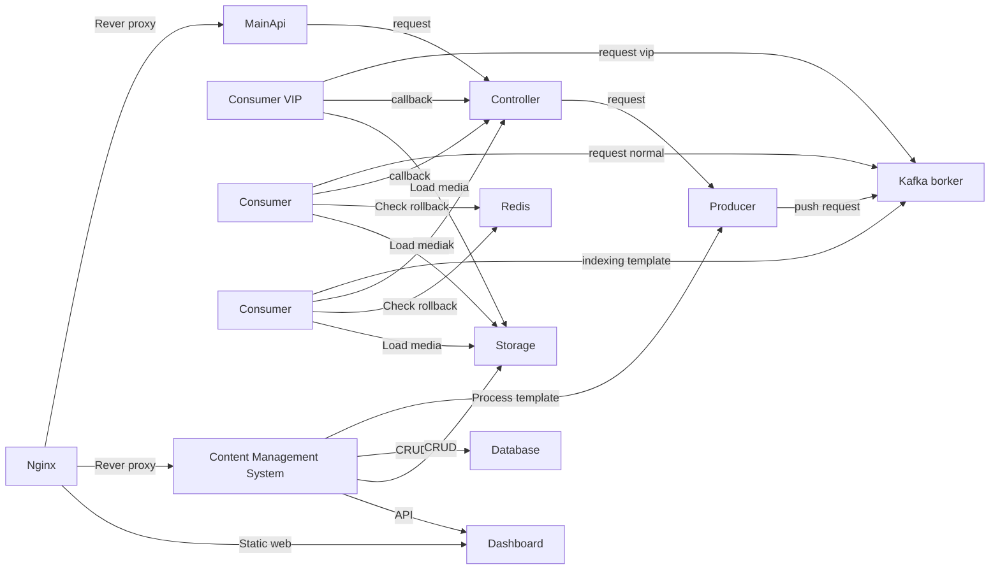

# 1. Introduction
## System achitecture

```mermaid
graph LR
MainAPi[MainApi] --request--> Ctr[Controller] --request--> Pro1[Producer]
S3[Storage]
Db[Database]
Cache[Redis]
Pro1[Producer] --push request --> Kaf[Kafka borker]
Con1[Consumer VIP] --request vip -->  Kaf[Kafka borker]
Con2[Consumer] --request normal --> Kaf[Kafka borker]
Con3[Consumer] --indexing template --> Kaf[Kafka borker]
Con1 --callback-->Ctr
Con2 --callback-->Ctr
Con3 --callback-->Ctr
Con2 -- Check rollback --> Cache
Con3 -- Check rollback --> Cache
Cms[Content Management System]--Process template-->Pro1
Cms -- CRUD --> Db
Cms -- CRUD --> S3
Con1-- Load media --> S3
Con2-- Load media --> S3
Con3-- Load media --> S3

Nginx -- Rever proxy --> MainAPi
Nginx -- Rever proxy --> Cms
Nginx -- Static web --> Dashboard[Dashboard]
Cms -- API --> Dashboard

```
## 1.1. What is StackEdit?
